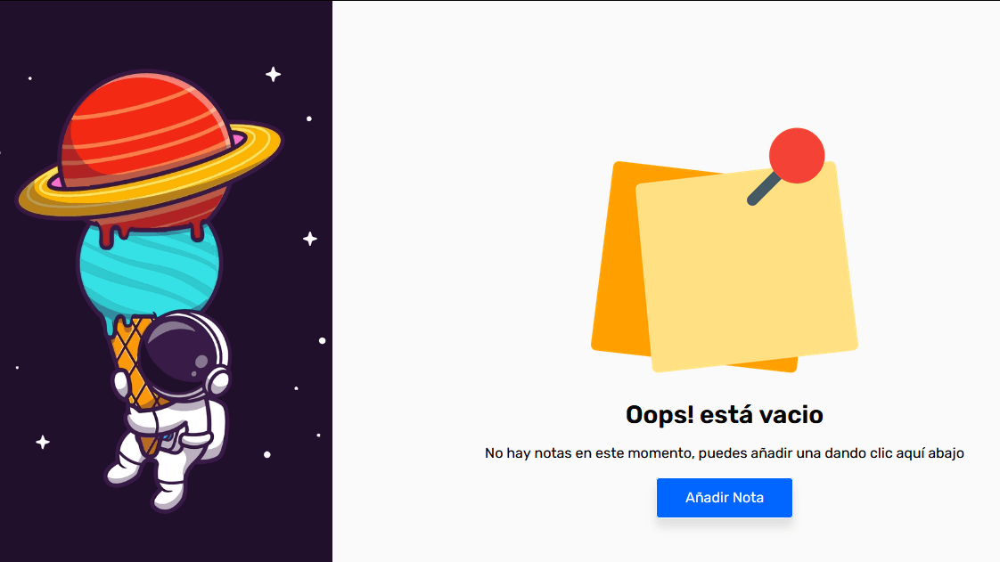
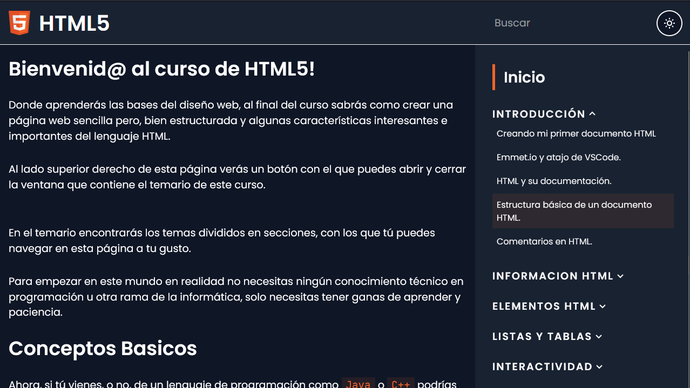
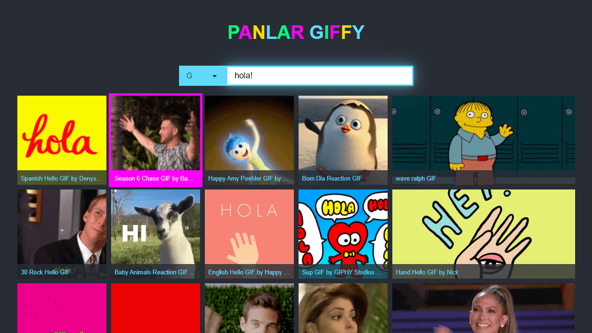
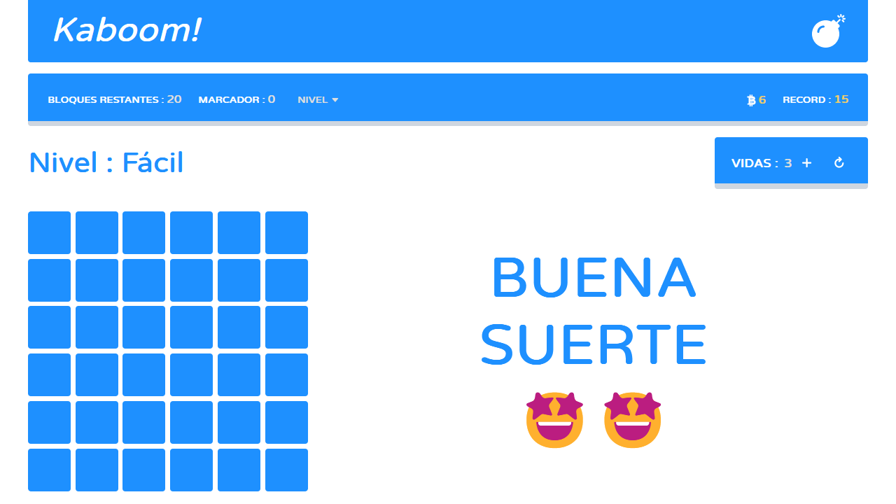

<h1 align="center">Johan Barahona | Desarrollador y Diseñador Web & UI</h1>

<h3 align="center">
<a href="https://panlar.github.io">
Ver Mi Portafolio Web
</a>
</h3>

Johan Barahona es un Desarrollador y Diseñador Web & UI Freelancer con 2 años de experiencia en esta área.

En mi experiencia aprendiendo y practicando el desarrollo y diseño web he conocido a grandes desarrolladores y desarrolladores a los cuales me gustaria hacerles mención aquí, ellos son, [Midudev](https://midu.dev/), [Jon Mircha](https://jonmircha.com/), [Carlos Azaustre](https://carlosazaustre.es/), [Soy Dalto](https://youtube.com/soydalto), [Bedimcode](https://youtube.com/bedimcode), [Coding Nepal](https://youtube.com/codingnepal)

 

<h2 align="center">Mis Redes Sociales</h2>

  
  
  
  
  
  
  

<h2 align="center">Habilidades Y Tecnologías</h2>

    
    
    
    
    
    
    

<h2 align="center">Mis Proyectos</h2>

- [Panlar Color Picker](https://panlar.github.io/colorpicker) 
- [Panlar Notes](https://react-notes-panlar.vercel.app/) 
- [Panlar Curso HTML](https://panlar.github.io/curso-html) 
- [Panlar Giffy](https://giffy-panlar.vercel.app/) 
- [Kaboom](https://panlar.github.io/kaboom) 

<!--
**panlar/panlar** is a ✨ _special_ ✨ repository because its `README.md` (this file) appears on your GitHub profile.

Here are some ideas to get you started:

- 🔭 I’m currently working on ...
- 🌱 I’m currently learning ...
- 👯 I’m looking to collaborate on ...
- 🤔 I’m looking for help with ...
- 💬 Ask me about ...
- 📫 How to reach me: ...
- 😄 Pronouns: ...
- ⚡ Fun fact: ...
-->
