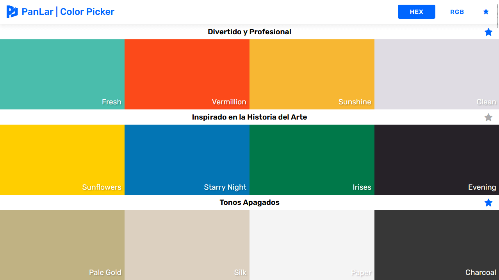
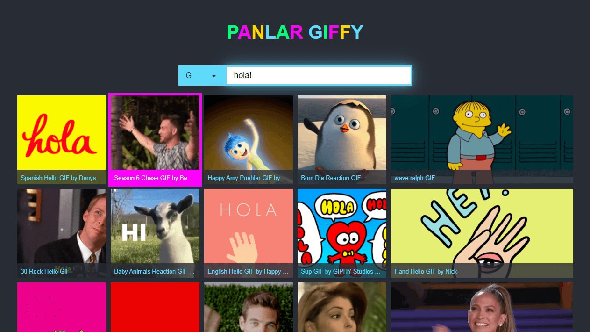
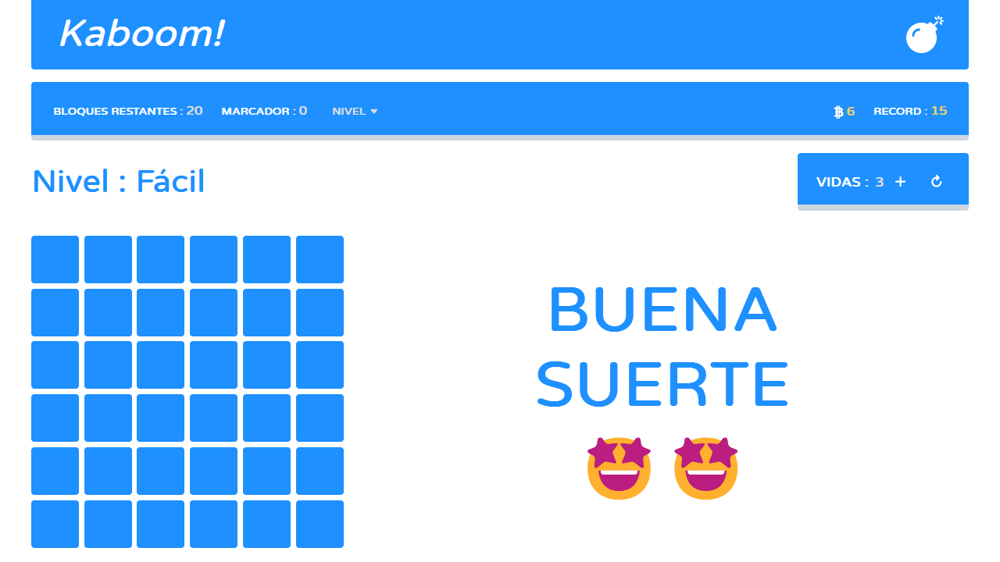

<h1 align="center" style="border: none;">Johan Barahona | Desarrollador y Diseñador Web & UI</h1>

---
<a href="https://panlar.github.io">
<h3 align="center" style="border: none;">Ver Mi Portafolio Web</h3>
</a>

---

---

Johan Barahona es un Desarrollador y Diseñador Web & UI Freelancer con 2 años de experiencia en esta área.

> En mi experiencia aprendiendo y practicando el desarrollo y diseño web he conocido a grandes desarrolladores y desarrolladores a los cuales me gustaria hacerles mención aquí, ellos son, [Midudev](https://midu.dev/), [Jon Mircha](https://jonmircha.com/), [Carlos Azaustre](https://carlosazaustre.es/), [Soy Dalto](https://youtube.com/soydalto), [Bedimcode](https://youtube.com/bedimcode), [Coding Nepal](https://youtube.com/codingnepal)

---

<h2 align="center" style="border: none;">Mis Redes Sociales</h2>

  
  
  
  
  
  
  

---

<h2 align="center" style="border: none;">Habilidades Y Tecnologías</h2>

    
    
    
    
    
    
    

---

<h2 align="center" style="border: none;">Mis Proyectos</h2>

<a href="">

Panlar Color Picker - HTML, CSS, JavaScript
</a>
<a href="">

Panlar Notes - HTML, CSS, React.js
</a>
<a href="">

Panlar Curso HTML - HTML, CSS, React.js
</a>
<a href="">

Panlar Giffy - HTML, CSS, React.js
</a>
<a href="">

Panlar Kaboom - HTML, CSS, JavaScript, Game Development
</a>

<!--
**panlar/panlar** is a ‚ú® _special_ ‚ú® repository because its `README.md` (this file) appears on your GitHub profile.

Here are some ideas to get you started:

- 🔭 I’m currently working on ...
- 🌱 I’m currently learning ...
- 👯 I’m looking to collaborate on ...
- 🤔 I’m looking for help with ...
- 💬 Ask me about ...
- üì´ How to reach me: ...
- üòÑ Pronouns: ...
- ‚ö° Fun fact: ...
-->
